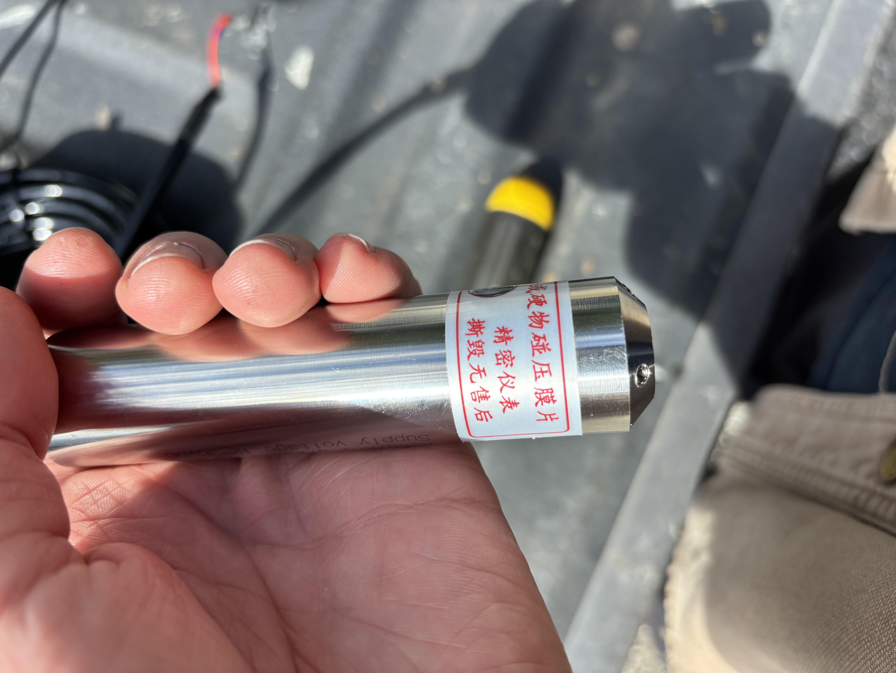
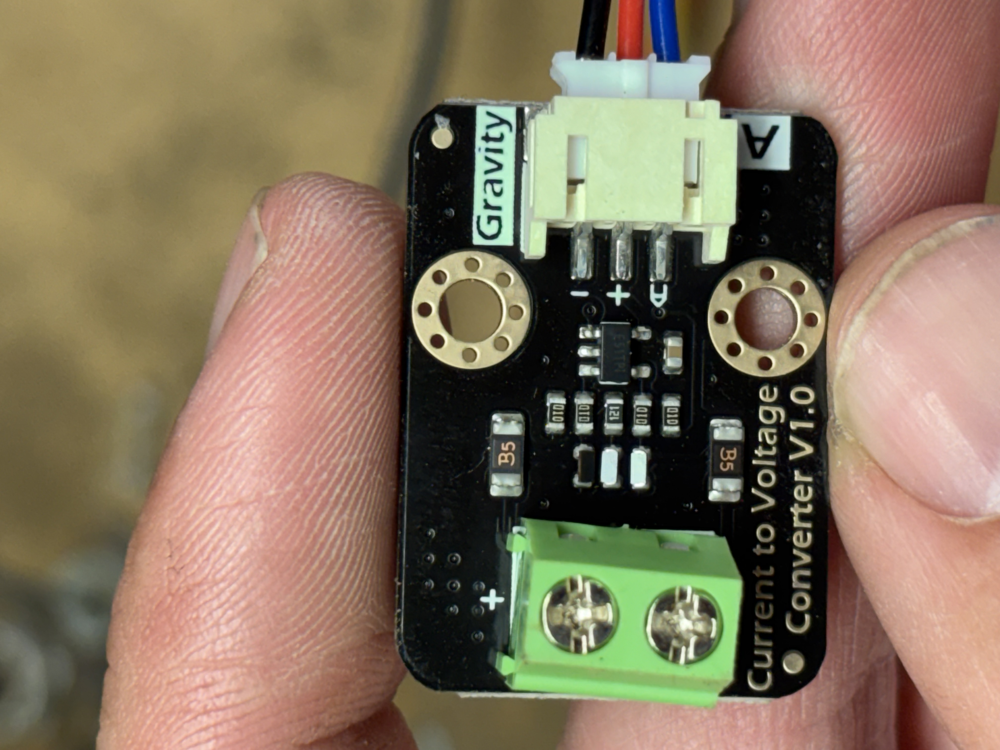
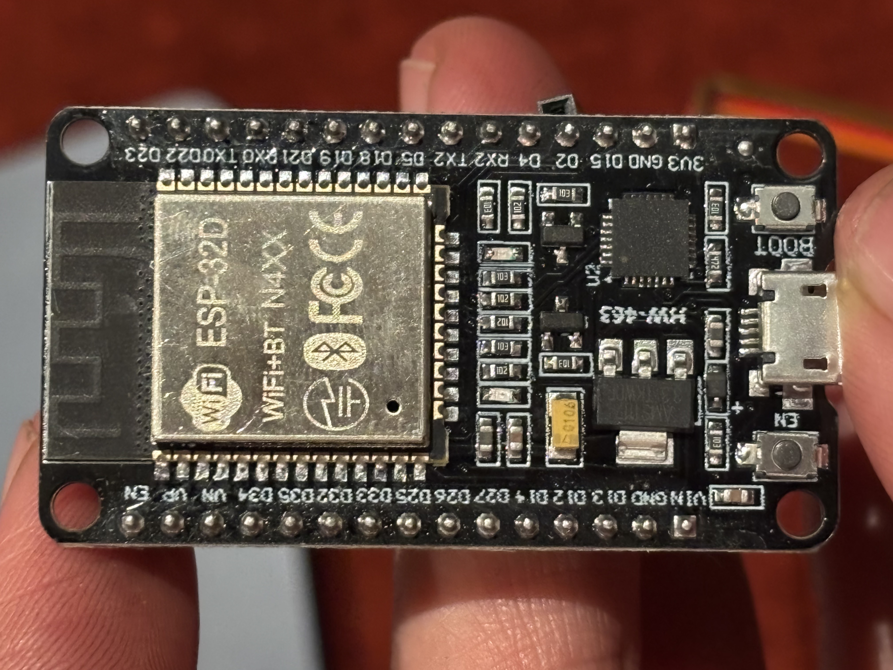
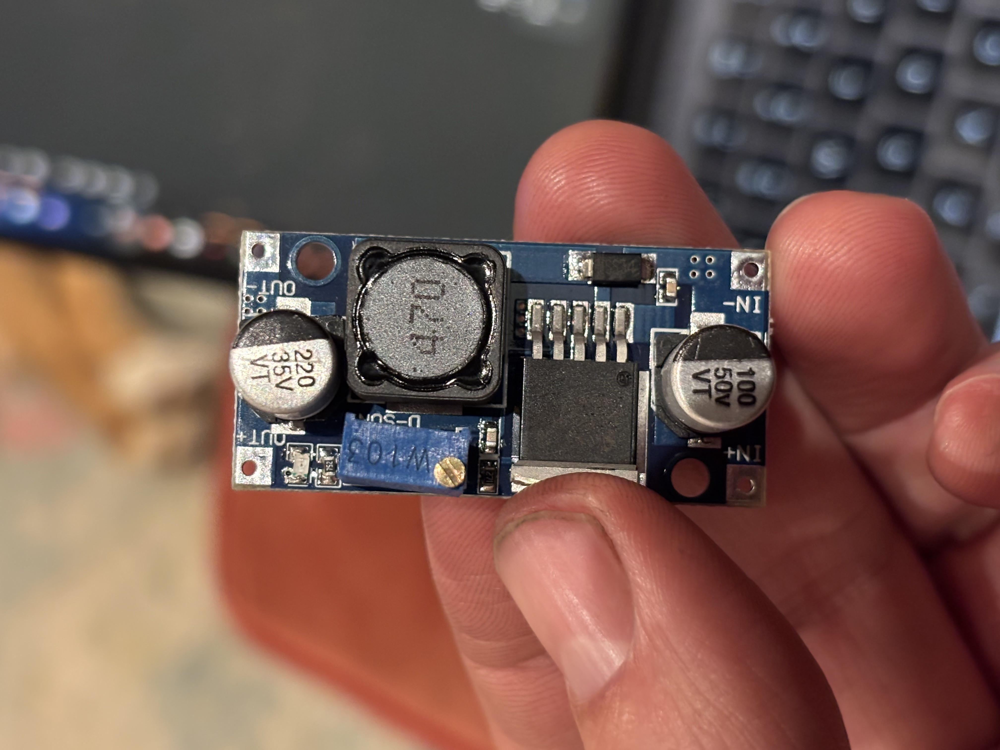
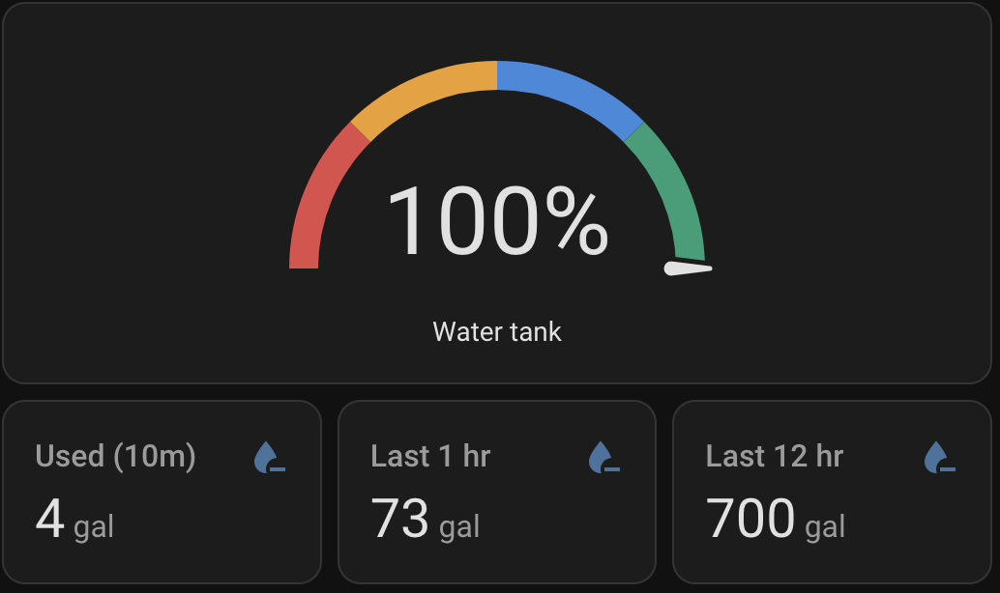
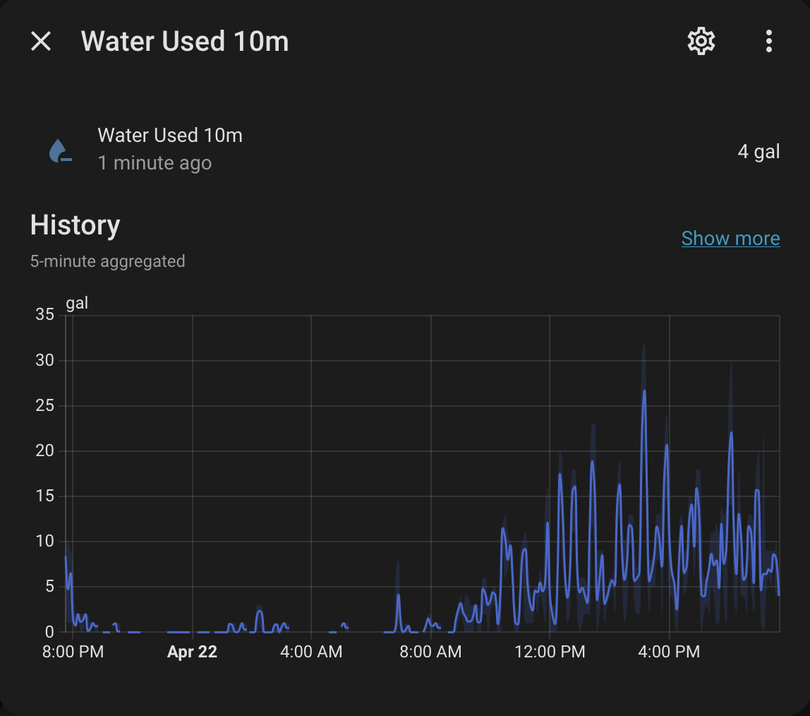
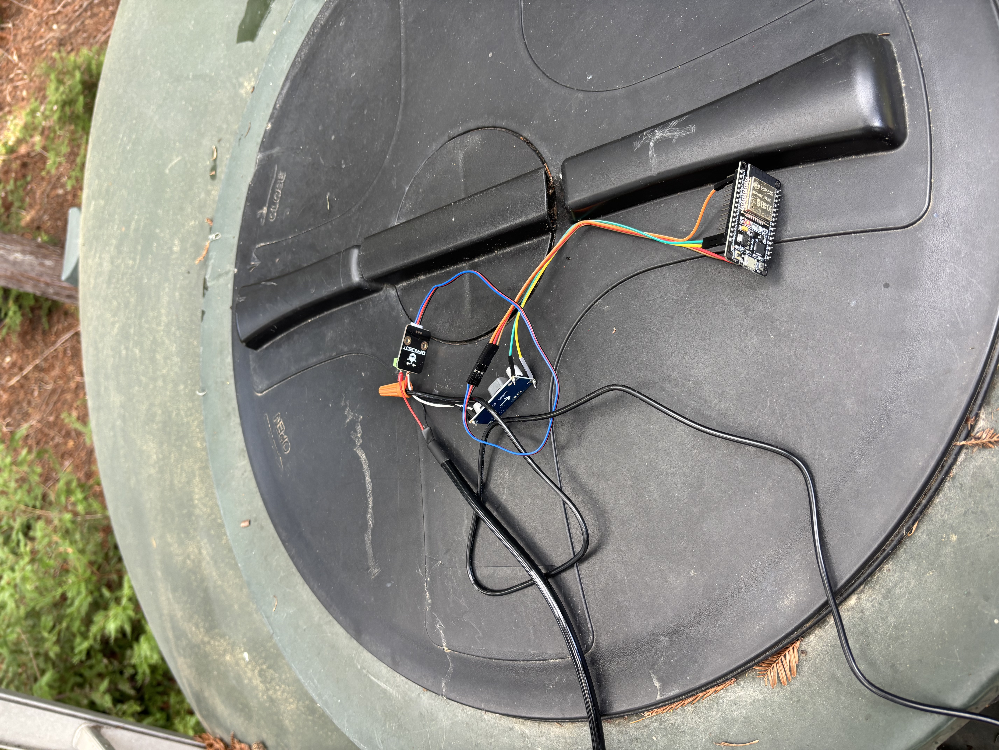
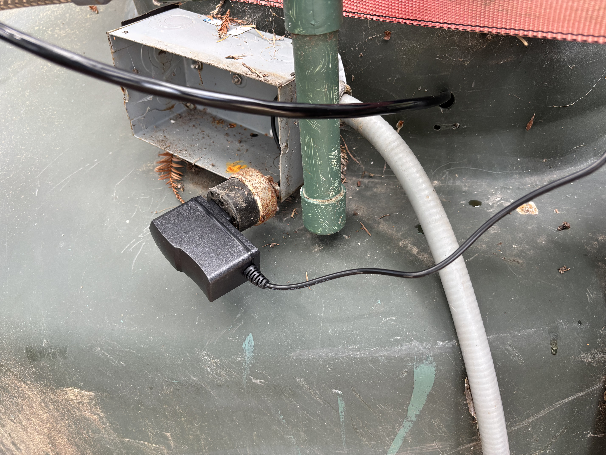

Growing up off the grid, we'd run out of water yearly, and the recharge time of the well slowed more and more as the dry season progressed. Sometimes we'd run out of water from normal use, but many times it was because there was a leak in the complex system of irrigation and household water and the tank would drain overnight.

My grandparents have checked the water level religiously, by going out and knocking on the side of the tank multiple times per day. This doesn't work when they're asleep or not home. Further, the periodic trip to the tank is getting more difficult as they get older.

I wanted to build a real-time water level sensor for them that I could hook up in Home Assistant and it would be accessible via their phone and tablets that I placed around the house. And that could alert them if water level was low or falling too quickly. 

After many attempts over the years I finally built something that works: a submersible pressure sensor hanging at the bottom of the tank, wired to an ESP32 that sends readings over WiFi to a small server in my grandmother's sewing room running homeassistant. 
Total parts cost was around \$100.

# Table of Contents

- [Table of Contents](#table-of-contents)
- [Parts](#parts)
- [How It Works](#how-it-works)
- [Wiring](#wiring)
    - [12V side (current loop)](#12v-side-current-loop)
    - [ESP32 power (LM2596)](#esp32-power-lm2596)
    - [Signal side (SEN0262 → ESP32)](#signal-side-sen0262--esp32)
- [ESPHome](#esphome)
- [Home Assistant](#home-assistant)
    - [Calibration](#calibration)
- [Dashboard](#dashboard)
- [Alerts](#alerts)
- [Mounting](#mounting)
- [Some notes and resources](#some-notes-and-resources)

# Parts

<table>
  <thead><tr><th>Item</th><th></th><th>Notes</th></tr></thead>
  <tbody>
    <tr>
      <td><a href="https://www.dfrobot.com/product-1863.html">DFRobot KIT0139</a><br><small>(GL-136 sensor + SEN0262 converter)</small></td>
      <td><a data-fancybox="gallery" href="./images/IMG_9224.jpeg"></a></td>
      <td>Submersible, 0–5m range, 4–20mA, 316L stainless steel, 5m cable</td>
    </tr>
    <tr>
      <td>SEN0262 current-to-voltage converter</td>
      <td><a data-fancybox="gallery" href="./images/IMG_9226.jpeg"></a></td>
      <td>Included in KIT0139. Converts the 4–20mA loop to a 0–3.3V analog signal.</td>
    </tr>
    <tr>
      <td><a href="https://www.amazon.com/dp/B07WCG1PLV">ESP32 DevKit V1 (38-pin DOIT style)</a></td>
      <td><a data-fancybox="gallery" href="./images/IMG_9220.jpeg"></a></td>
      <td>Any ESP32 dev board works.</td>
    </tr>
    <tr>
      <td><a href="https://www.amazon.com/dp/B0DBVYP91F">LM2596 buck converter</a></td>
      <td><a data-fancybox="gallery" href="./images/IMG_9221.jpeg"></a></td>
      <td>Steps 12V down to 5V. Set the output with a multimeter before wiring it to the ESP32.</td>
    </tr>
    <tr>
      <td><a href="https://www.amazon.com/dp/B0852HX9HV">12V 2A wall adapter</a></td>
      <td></td>
      <td>One power source for the whole system.</td>
    </tr>
    <tr>
      <td>a small server (raspberry pi) running homeassistant</td>
      <td></td>
      <td>Hosts ESPHome and Home Assistant. See this <a href="https://www.home-assistant.io/installation/raspberrypi/">example</a> tutorial.</td>
    </tr>
    <tr>
      <td>Jumper wires (female-to-male)</td>
      <td></td>
      <td>For connecting the SEN0262, ESP32, and LM2596.</td>
    </tr>
  </tbody>
</table>

A note on sensor range: the KIT0139 is rated 0–5m. An 11.5ft tank uses about 70% of that range, which is plenty of headroom. Don't substitute a 0–1m or 0–2m sensor. The reading will saturate before the tank is full.

# How It Works

The GL-136 uses a 4–20mA current loop. With the sensor in air it draws 4mA, and at its maximum depth of 5 meters of water it draws 20mA. The SEN0262 converter sits in the loop, measures that current across a 120Ω sense resistor, and outputs a proportional voltage. In practice that's roughly 0.5V with the sensor in air and about 2V at the depth of our tank. The wiring diagram below shows how all of this connects.

ESPHome's job is minimal. It reads the raw ADC voltage and publishes it. Home Assistant handles all the calibration math. You tell HA what voltage you see when the tank is empty and when it's full, and it calculates level, percentage, and volume from that. This way calibration is a UI adjustment rather than a firmware reflash.

> **Note:** This was a long, iterative project outside my usual expertise, so there's a chance my description here isn't exactly how it ended up. The YAML is exactly what I used, but my description of the wiring may be a bit off — I'll double-check the next time I'm at my grandparents'. That said, this gets just about all of it, and I believe any trouble should be easy enough to resolve.

# Wiring

Because I deviated from the manufacturers wiring so that I could power the ESP32 and GL-136 sensor with one power supply, I had to create a bespoke wiring diagram. 
This part was out of my comfort zone, so I relied on some help from LLMs, which in general I'm hesitant to do outside of my area of expertise. But it worked, and I suppose that's the best verification I could get.

<figure style="text-align:center; margin: 1.5em auto;">
  
  <figcaption><em>Full wiring diagram. One 12V supply powers both the sensor current loop and the ESP32 through the LM2596.</em></figcaption>
</figure>

### 12V side (current loop)

At the SEN0262 green screw terminal:
- 12V adapter **positive** → green terminal **+** (top screw)
- Green terminal **-** (bottom screw) → sensor **red wire**
- Sensor **black wire** → 12V adapter **negative** directly (bypasses SEN0262)

The current path: **12V+ → terminal + → terminal - → sensor red → through sensor → sensor black → 12V-**

### ESP32 power (LM2596)

Tap from the same 12V supply to the LM2596. Set its output to 5V with a multimeter before wiring it to the ESP32.

- 12V **positive** tap → LM2596 **IN+**
- 12V **negative** tap → LM2596 **IN-**
- LM2596 **OUT+** (5V) → ESP32 **VIN**
- LM2596 **OUT-** → ESP32 **GND**

### Signal side (SEN0262 → ESP32)

The SEN0262 has a 3-wire JST output connector. Use female-to-male jumper wires:
- SEN0262 **red** → ESP32 **3V3**
- SEN0262 **gray** → ESP32 **GND** (shared with LM2596 OUT-)
- SEN0262 **blue** → ESP32 **VP** (GPIO36, analog input)

A note on output voltage: the SEN0262 V1.0 board has no voltage jumper. The output range is set by whatever you feed the VCC pin on the Gravity connector. Since we wire the red wire to ESP32 3V3, the signal output scales to the 0–3.3V range automatically. No configuration needed, but it does mean the ESP32's 3.3V rail needs to be stable.


# ESPHome

Install ESPHome as a Home Assistant add-on (**Settings → Add-ons → Add-on Store → ESPHome**), or via pip for first-time flashing from a laptop:

```bash
pip install esphome
```

The config is intentionally minimal. ESPHome only publishes the raw voltage and WiFi signal strength. All the level math lives in Home Assistant where it's easy to tune.

The `!secret` references pull from a `secrets.yaml` file in the same directory:

**`secrets.yaml`:**

```yaml
wifi_ssid: "YourNetworkName"
wifi_password: "YourWiFiPassword"
api_encryption_key: "base64-encoded-32-byte-key"
ota_password: "something-secret"
fallback_ap_password: "something-secret"
```

Generate the API encryption key with:

```bash
python3 -c "import secrets, base64; print(base64.b64encode(secrets.token_bytes(32)).decode())"
```


```yaml
esphome:
  name: tank-level-monitor
  friendly_name: "Water Tank Level Monitor"

esp32:
  board: esp32dev

logger:

api:
  encryption:
    key: !secret api_encryption_key

ota:
  - platform: esphome
    password: !secret ota_password

wifi:
  ssid: !secret wifi_ssid
  password: !secret wifi_password

  ap:
    ssid: "Tank-Monitor-Fallback"
    password: !secret fallback_ap_password

captive_portal:

sensor:
  - platform: adc
    pin: GPIO36
    id: tank_voltage
    name: "Tank Sensor Voltage"
    attenuation: 11db
    update_interval: 10s
    accuracy_decimals: 3
    unit_of_measurement: "V"
    filters:
      - sliding_window_moving_average:
          window_size: 6
          send_every: 6
    internal: false

  - platform: wifi_signal
    name: "Tank Monitor WiFi Signal"
    update_interval: 60s
```


Connect the ESP32 over USB and flash:

```bash
esphome run water-tank-level-monitor.yaml
```

You should see it flash properly in the terminal and start reporting voltage values for the sensor. After the first flash you can do all future updates wirelessly from the ESPHome dashboard in Home Assistant.

# Home Assistant

Once the device shows up under **Settings → Devices & Services → ESPHome**, it exposes the raw voltage sensor. The rest of the logic lives in a package file.

Add the package reference to `configuration.yaml`:

```yaml
homeassistant:
  packages:
    water_tank: !include packages/water_tank.yaml
```

Then create `config/packages/water_tank.yaml`. This file does a few things worth understanding:

- **`input_number` helpers** for calibration. The empty voltage, full voltage, tank height, and capacity are all adjustable from the HA dashboard, no reflash needed.
- **Template sensors** that override the ESPHome voltage reading with calibrated level, percentage, and volume values.
- **A derivative sensor** that calculates instantaneous drain rate in gal/h.
- **An integration sensor** that only accumulates drain events. When the tank is filling, the rate is clamped to zero, so the "water used" counter never decreases during a refill. This means "used last 12hr" reflects actual consumption regardless of how many times the pump ran.
- **Statistics sensors** for rolling 10-minute, 1-hour, and 12-hour consumption windows.

Here's the full `water_tank.yaml`:


```yaml
# ============================================================================
# Water tank: calibration, level/volume templates, net change, usage (refill-safe)
# ============================================================================

input_number:
  tank_calibration_voltage_empty:
    name: Tank calibration voltage (empty)
    min: 0
    max: 3.5
    step: 0.001
    mode: box
    unit_of_measurement: "V"
    initial: 0.718
  tank_calibration_voltage_full:
    name: Tank calibration voltage (full)
    min: 0
    max: 3.5
    step: 0.001
    mode: box
    unit_of_measurement: "V"
    initial: 1.993
  tank_height_ft:
    name: Tank height
    min: 1
    max: 50
    step: 0.1
    mode: box
    unit_of_measurement: "ft"
    initial: 11.5
  tank_capacity_gal:
    name: Tank capacity
    min: 100
    max: 100000
    step: 1
    mode: box
    unit_of_measurement: "gal"
    initial: 5184

sensor:
  - platform: statistics
    name: "Tank Volume Stats 1h"
    entity_id: sensor.water_tank_level_monitor_tank_volume
    state_characteristic: average_linear
    max_age:
      hours: 1

  - platform: statistics
    name: "Tank Volume Stats 12h"
    entity_id: sensor.water_tank_level_monitor_tank_volume
    state_characteristic: average_linear
    max_age:
      hours: 12

  - platform: statistics
    name: "Tank Volume Stats 24h"
    entity_id: sensor.water_tank_level_monitor_tank_volume
    state_characteristic: average_linear
    max_age:
      hours: 24

  # Instantaneous rate of volume change (gal/h), smoothed over 10 min
  - platform: derivative
    name: "Tank Volume Rate"
    source: sensor.water_tank_level_monitor_tank_volume
    unit_time: h
    time_window: "00:10:00"

  # Cumulative consumption: integrates only drain rate, never decreases on refill
  - platform: integration
    name: "Water Used Cumulative"
    source: sensor.water_consumption_rate
    unit_time: h
    method: trapezoidal

  - platform: statistics
    name: "Water Used Stats 10m"
    entity_id: sensor.water_used_cumulative
    state_characteristic: change
    max_age:
      minutes: 10

  - platform: statistics
    name: "Water Used Stats 1h"
    entity_id: sensor.water_used_cumulative
    state_characteristic: change
    max_age:
      hours: 1

  - platform: statistics
    name: "Water Used Stats 12h"
    entity_id: sensor.water_used_cumulative
    state_characteristic: change
    max_age:
      hours: 12

template:
  - sensor:
      - name: "Water Tank Level Monitor Water Level"
        unique_id: ha_tank_water_level_calibrated
        default_entity_id: sensor.water_tank_level_monitor_water_level
        unit_of_measurement: "ft"
        state_class: measurement
        icon: mdi:water
        availability: >
          {{ states('sensor.water_tank_level_monitor_tank_sensor_voltage') not in ['unknown', 'unavailable', 'none']
             and (states('input_number.tank_calibration_voltage_full') | float(0)
                  - states('input_number.tank_calibration_voltage_empty') | float(0)) > 0.001 }}
        state: >
          
          
          
          
          
          
          {{ 0.0 | round(1) }}
          {{ h | round(1) }}
          {{ raw | round(1) }}
          

      - name: "Water Tank Level Monitor Tank Percentage"
        unique_id: ha_tank_percentage_calibrated
        default_entity_id: sensor.water_tank_level_monitor_tank_percentage
        unit_of_measurement: "%"
        state_class: measurement
        icon: mdi:percent
        availability: >
          {{ states('sensor.water_tank_level_monitor_tank_sensor_voltage') not in ['unknown', 'unavailable', 'none']
             and (states('input_number.tank_calibration_voltage_full') | float(0)
                  - states('input_number.tank_calibration_voltage_empty') | float(0)) > 0.001 }}
        state: >
          
          
          
          
          
          
          
          0{{ ((level / h) * 100) | round(0) }}

      - name: "Water Tank Level Monitor Tank Volume"
        unique_id: ha_tank_volume_calibrated
        default_entity_id: sensor.water_tank_level_monitor_tank_volume
        unit_of_measurement: "gal"
        state_class: measurement
        icon: mdi:water-pump
        availability: >
          {{ states('sensor.water_tank_level_monitor_tank_sensor_voltage') not in ['unknown', 'unavailable', 'none']
             and (states('input_number.tank_calibration_voltage_full') | float(0)
                  - states('input_number.tank_calibration_voltage_empty') | float(0)) > 0.001 }}
        state: >
          
          
          
          
          
          
          
          
          0
          
          0{{ cap | round(0) }}{{ vol | round(0) }}
          

      - name: "Tank Volume Change 1h"
        unique_id: tank_volume_change_1h
        unit_of_measurement: "gal"
        state: >
          
          
          
            {{ (current - (avg | float(current))) | round(0) }}
          
            0
          

      - name: "Tank Volume Change 12h"
        unique_id: tank_volume_change_12h
        unit_of_measurement: "gal"
        state: >
          
          
          
            {{ (current - (avg | float(current))) | round(0) }}
          
            0
          

      - name: "Tank Volume Change 24h"
        unique_id: tank_volume_change_24h
        unit_of_measurement: "gal"
        state: >
          
          
          
            {{ (current - (avg | float(current))) | round(0) }}
          
            0
          

      # Consumption rate: positive gal/h when draining, 0 during refills
      - name: "Water Consumption Rate"
        unique_id: water_consumption_rate
        unit_of_measurement: "gal/h"
        state_class: measurement
        icon: mdi:water-minus
        state: >
          
          {{ [0, -rate] | max | round(2) }}

      - name: "Water Used 10m"
        unique_id: water_used_display_10m
        default_entity_id: sensor.water_used_10m
        unit_of_measurement: "gal"
        state_class: measurement
        icon: mdi:water-minus
        availability: "{{ states('sensor.water_used_stats_10m') not in ['unknown', 'unavailable', 'none'] }}"
        state: "{{ states('sensor.water_used_stats_10m') | float(0) | round(0) }}"

      - name: "Water Used 1h"
        unique_id: water_used_display_1h
        default_entity_id: sensor.water_used_1h
        unit_of_measurement: "gal"
        state_class: measurement
        icon: mdi:water-minus
        availability: "{{ states('sensor.water_used_stats_1h') not in ['unknown', 'unavailable', 'none'] }}"
        state: "{{ states('sensor.water_used_stats_1h') | float(0) | round(0) }}"

      - name: "Water Used 12h"
        unique_id: water_used_display_12h
        default_entity_id: sensor.water_used_12h
        unit_of_measurement: "gal"
        state_class: measurement
        icon: mdi:water-minus
        availability: "{{ states('sensor.water_used_stats_12h') not in ['unknown', 'unavailable', 'none'] }}"
        state: "{{ states('sensor.water_used_stats_12h') | float(0) | round(0) }}"

  - binary_sensor:
      - name: "Water Tank Level Monitor Tank Low Water Alert"
        unique_id: ha_tank_low_water_calibrated
        default_entity_id: binary_sensor.water_tank_level_monitor_tank_low_water_alert
        icon: mdi:water-alert
        delay_on:
          seconds: 60
        delay_off:
          seconds: 5
        state: >
          
          {{ false }}
          
          
          
          
          
          {{ false }}
          
          
          
          {{ pct < 10 }}
          
          
```


Restart Home Assistant after adding this. You'll get entities like `sensor.water_tank_level_monitor_tank_percentage`, `sensor.water_used_1h`, and so on.

### Calibration

The `input_number` defaults in the package are from our tank, so you'll need to set your own. The good news is that only the **full** calibration voltage actually requires any effort.

**Empty voltage:** hold the sensor in air and check **Developer Tools → States** for `tank_sensor_voltage`. The sensor reads about 0.48–0.51V out of water (4mA × 120Ω sense resistor). Set that as your empty calibration value before dropping the sensor in.

**Full voltage:** after a full pump cycle with the tank full, check the same entity and note the reading. That's your full calibration voltage. We measured about 1.99V at our 11.5ft tank, well below the theoretical 2.4V maximum since the tank only uses about 70% of the sensor's 5m range.

Update the tank height and capacity to match your actual tank.

# Dashboard

In HA go to **Edit dashboard → Add Card → Manual** and paste:


```yaml
type: vertical-stack
cards:
  - type: gauge
    entity: sensor.water_tank_level_monitor_tank_percentage
    name: Water tank
    unit: "%"
    needle: true
    min: 0
    max: 100
    segments:
      - from: 0
        color: "#E24B4A"
      - from: 25
        color: "#EF9F27"
      - from: 50
        color: "#378ADD"
      - from: 75
        color: "#1D9E75"
  - type: entities
    entities:
      - entity: sensor.water_tank_level_monitor_tank_volume
        name: Volume
        icon: mdi:water
      - entity: sensor.water_tank_level_monitor_water_level
        name: Water level
        icon: mdi:ruler
      - entity: sensor.water_tank_level_monitor_tank_sensor_voltage
        name: Sensor voltage (raw)
        icon: mdi:sine-wave
      - entity: sensor.water_tank_level_monitor_tank_monitor_wifi_signal
        name: WiFi signal
        icon: mdi:wifi
  - type: entities
    title: Calibration
    entities:
      - entity: input_number.tank_calibration_voltage_empty
        name: Voltage at empty
      - entity: input_number.tank_calibration_voltage_full
        name: Voltage at full
      - entity: input_number.tank_height_ft
        name: Tank height
      - entity: input_number.tank_capacity_gal
        name: Tank capacity
  - type: horizontal-stack
    cards:
      - type: entity
        entity: sensor.water_used_10m
        name: Used (10m)
        icon: mdi:water-minus
      - type: entity
        entity: sensor.water_used_1h
        name: Last 1 hr
        icon: mdi:water-minus
      - type: entity
        entity: sensor.water_used_12h
        name: Last 12 hr
        icon: mdi:water-minus
  - type: history-graph
    entities:
      - entity: sensor.water_tank_level_monitor_tank_volume
        name: Volume
    hours_to_show: 12
```


<figure style="text-align:center; margin: 1.5em auto;">
  <a data-fancybox="gallery" href="./images/ha-dashboard.png">
    
  </a>
  <figcaption><em>The main dashboard card. The gauge shows tank percentage with color-coded segments, and the water-used strip sits below.</em></figcaption>
</figure>

<figure style="text-align:center; margin: 1.5em auto;">
  <a data-fancybox="gallery" href="./images/water-used-history.png">
    
  </a>
  <figcaption><em>Water used over the past 24 hours. The afternoon spike is my mom getting home from work.</em></figcaption>
</figure>

# Alerts

Add to `automations.yaml`. Replace `notify.family` with your own notification service.


```yaml
- id: tank_low_water_25_percent
  alias: Tank low water alert (25%)
  trigger:
    - platform: numeric_state
      entity_id: sensor.water_tank_level_monitor_tank_percentage
      below: 25
      for:
        minutes: 5
  condition:
    - condition: template
      value_template: >
        {{ (as_timestamp(now()) -
            as_timestamp(state_attr('automation.tank_low_water_alert_25',
            'last_triggered') | default(0))) > 3600 }}
  action:
    - service: notify.family
      data:
        title: "Low water alert"
        message: >
          Tank is at {{ states('sensor.water_tank_level_monitor_tank_percentage') }}%
          ({{ states('sensor.water_tank_level_monitor_tank_volume') }} gal).

- id: tank_rapid_loss_10_percent
  alias: Tank rapid loss alert (100 gal in 1hr)
  trigger:
    - platform: template
      value_template: >
        {{ states('sensor.tank_volume_change_1h') | float(0) <= -100 }}
      for:
        minutes: 2
  action:
    - service: notify.family
      data:
        title: "Rapid water loss"
        message: >
          Tank has lost {{ states('sensor.tank_volume_change_1h') | float(0) | abs | round(0) }}
          gallons in the last hour. Currently at
          {{ states('sensor.water_tank_level_monitor_tank_percentage') }}%
          ({{ states('sensor.water_tank_level_monitor_tank_volume') }} gal).
```


The low-water automation has a 1-hour cooldown so it doesn't spam while the tank is sitting low. The cooldown references the automation's entity ID. If it doesn't seem to work, check **Developer Tools → States** for the actual entity ID HA assigned to the automation and update the `state_attr(...)` call to match.

# Mounting

Lower the sensor through the tank hatch so it hangs vertically from its cable, a few inches above the floor. Resting on the bottom can block the diaphragm with sediment. Secure the cable at the hatch with a zip tie or cable clamp.

<figure style="text-align:center; margin: 1.5em auto;">
  <a data-fancybox="gallery" href="./images/IMG_9228.jpeg">
    
  </a>
  <figcaption><em>Initial bench test on the tank lid. The sensor cable goes down through the hatch and the electronics sit on top.</em></figcaption>
</figure>

One thing to know: the sensor cable has a thin vent tube running through it for atmospheric pressure compensation. Don't clamp down so hard on the cable gland that you crush it. The small white filter cap that came with the kit stays attached to the cable end and keeps the tube open to air.

The 12V wall adapter is not weatherproof. Run it into a pump house or garage. The sensor and its cable are fine submerged, but everything else should stay under cover.


<figure style="text-align:center; margin: 1.5em auto;">
  <a data-fancybox="gallery" href="./images/IMG_9231.jpeg">
    
  </a>
  <figcaption><em>12V adapter on the tank. This and all the other wires got shoved in that electrical box.</em></figcaption>
</figure>

# Some notes and resources

Set the LM2596 before wiring it to the ESP32. Put a multimeter on the output terminals with the 12V supply connected, and turn the trim pot until you read 5V. An untuned buck converter can deliver too much voltage to the ESP32 VIN and fry the board.

The sensor manufacturer's wiring notes and specs live here: https://wiki.dfrobot.com/kit0139/#tech_specs. They don't include the ESP32 or the particular power supply setup we used, but I referenced it at the start of this build.